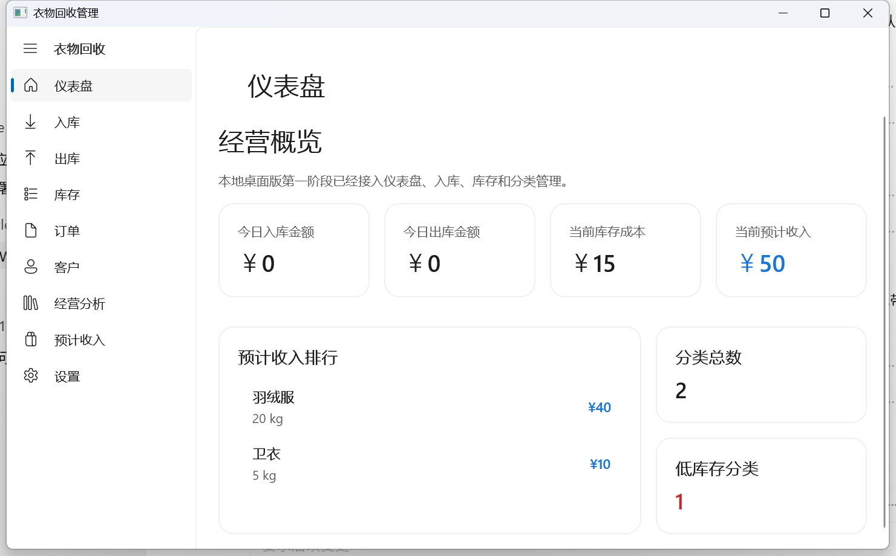

# 衣物回收管理 PC 版

`衣物回收管理` 是一个面向 Windows 的本地桌面应用，适合衣物回收、分拣和二次流通场景中的日常记账、库存管理和订单确认。

当前仓库对应版本：`v1.0.1`

## 适用场景

- 需要在固定电脑上完成入库、出库、库存和订单管理
- 希望数据保存在本地，不依赖云端系统
- 需要把订单确认单导出后发给客户留存

## 核心功能

### 入库工作台
- 先选择已有客户或新增客户，再填写本次入库分类明细
- 支持同一客户在一次入库中录入多个分类
- 确认入库后自动生成订单确认单

### 出库工作台
- 按类别快捷出库，先展示库存量和计量方式
- 点击类别后展开编辑客户、数量和单价
- 更适合“一家只卖一种”的出库场景
- 确认出库后自动生成订单确认单

### 订单中心
- 查看入库单和出库单明细
- 订单名称按 `入库/出库_yyyy_MM_dd_HH_mm_客户名` 展示
- 选中订单后可直接导出 `PDF` 或 `PNG`

### 订单导出
- 刚完成入库或出库时可直接导出确认单
- 历史订单也可以在订单中心重新导出
- 导出文件同名时会自动追加序号，避免覆盖原文件

### 库存与经营
- 库存页聚焦库存数量和盘点信息
- 预计收入集中展示在“预计收入”与仪表盘相关区域
- 支持库存调整、盘点差异、一致性检查和本地备份

## 界面预览

## 数据与安装说明

- 应用数据默认保存在 `%LOCALAPPDATA%\\ClothingRecycler`
- 卸载程序不会自动删除数据库、备份、导出和日志
- 安装包建议通过 GitHub Releases 获取
- 安装器已支持覆盖升级，并会尽量清理旧版本程序文件

## 常见问题

### 数据会不会上传到服务器？

不会。当前版本是纯本地桌面应用，主要数据保存在当前 Windows 用户目录。

### 录错订单怎么办？

可以在“订单中心”中找到对应订单后进行查看、编辑或删除，系统会同步回滚相关库存和派生数据。

### 能不能把确认单发给客户？

可以。订单确认单支持导出为 `PDF` 和 `PNG`，适合打印、归档或直接发送给客户确认。

## 快速上手

更适合最终使用者阅读的简明说明见：

- [README_BEGINNER.md](./README_BEGINNER.md)
